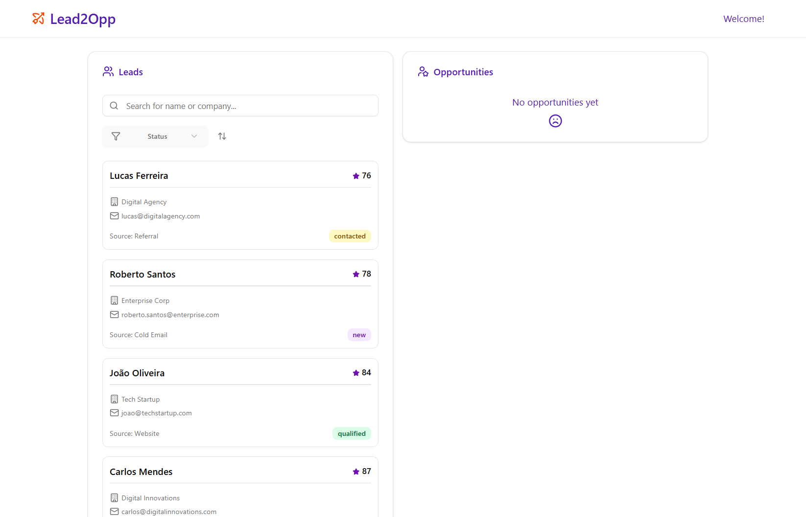
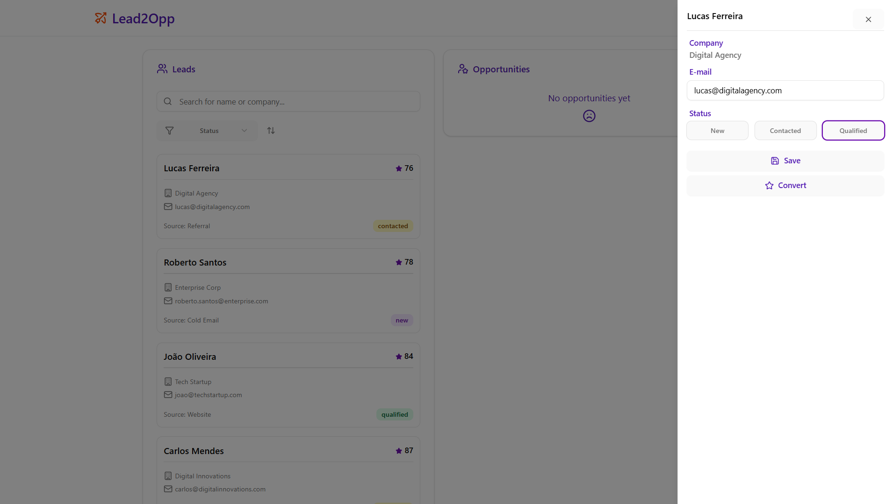
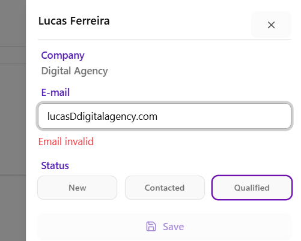
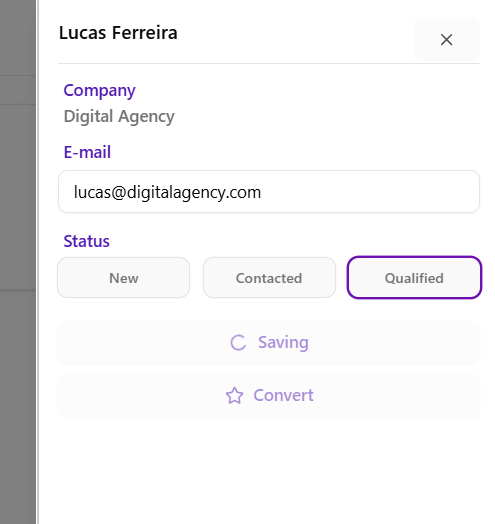
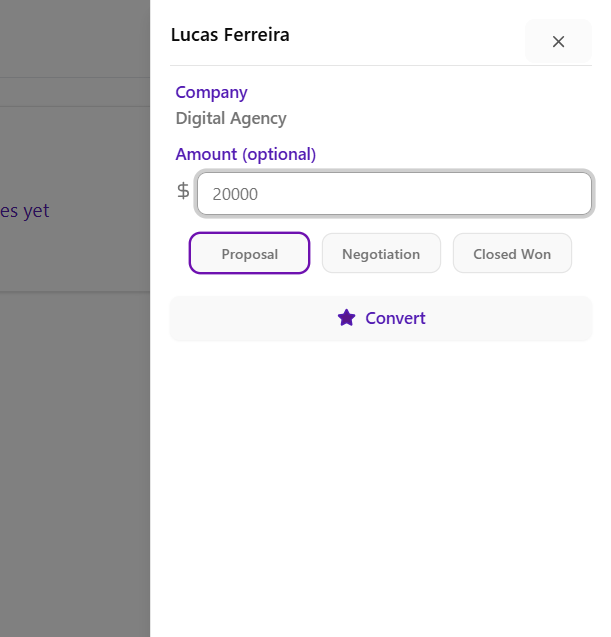
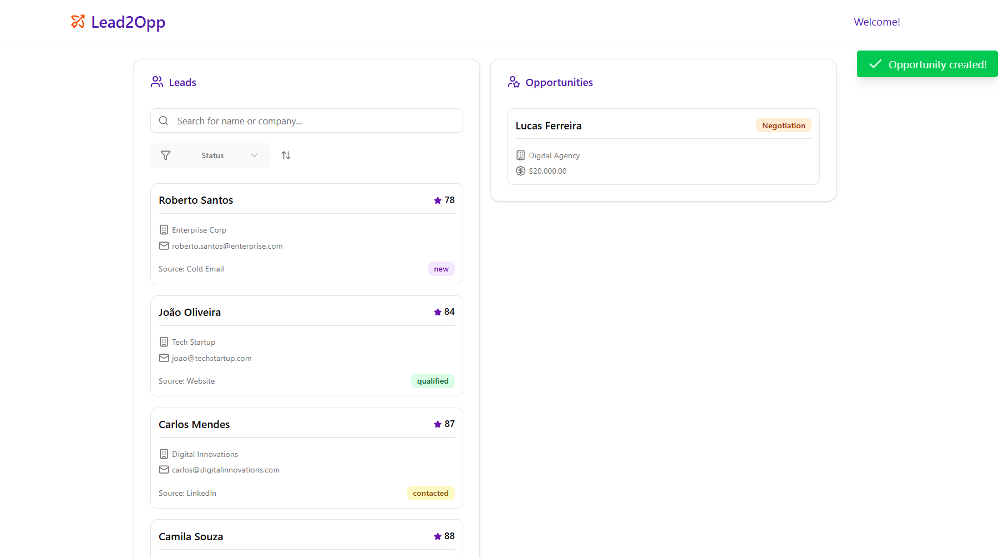
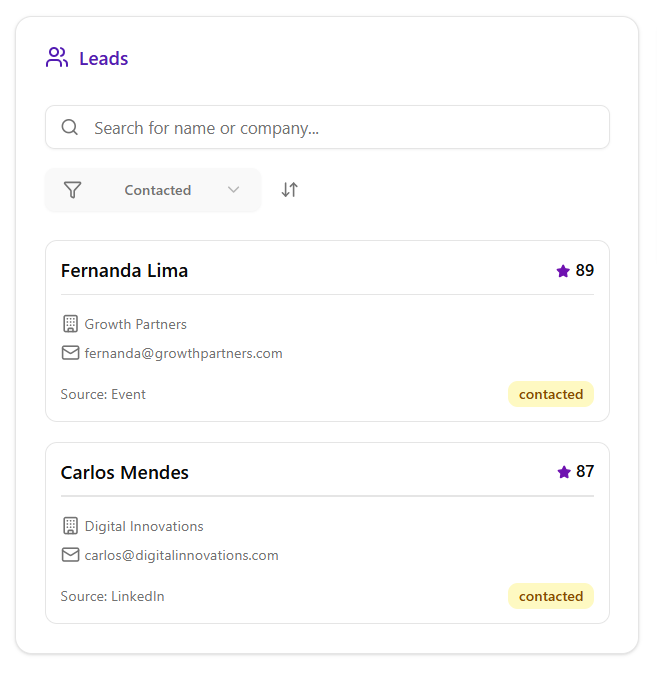

# Lead2Opp Management Panel

This is a React project for managing leads and converting them into opportunities. It includes search, filter, sort, edit, and conversion features, with toast notifications and detail sheets.

## Features

- List leads with search and filter by status
- Sort leads by score (ascending/descending)
- Edit lead details (email, status)
- Convert lead to opportunity with amount and stage
- Toast notifications for actions
- Responsive UI with cards and sheets

## Installation

1. Unzip the project:

2. Navigate to the project folder:

```bash
cd <project-folder>
```

3. Install dependencies:

```bash
npm install
```

4. Run the development server:

```bash
npm run dev
```

The app should now be running on http://localhost:5173/

## Screenshots








## Project Architecture

This project follows an **architecture inspired by the Hexagonal (Ports and Adapters) model**, organized into well-defined layers to ensure **separation of concerns, testability, and scalability**.

### Core Ideas

- **Domain** → Defines the system’s entities and core contracts. This is the most stable layer.
- **Repositories** → Handle data persistence (in-memory, JSON, or an external API/DB in the future).
- **Services** → Application layer that coordinates business rules with repositories.
- **Components** → Visual interface decoupled from business logic.
- **Hooks** → Encapsulate reusable logic and connect the UI with the service layer.

This approach allows the application to evolve in a modular way. For example:
- Repository implementations can be swapped (e.g., in-memory → REST API) without affecting business rules.
- The UI can evolve independently from services or domain.
- Enables **isolated unit testing** for each layer.
## Notes

* Requires Node.js >= 18
* Uses TailwindCSS, Radix UI, Lucide Icons, and local state for data management
